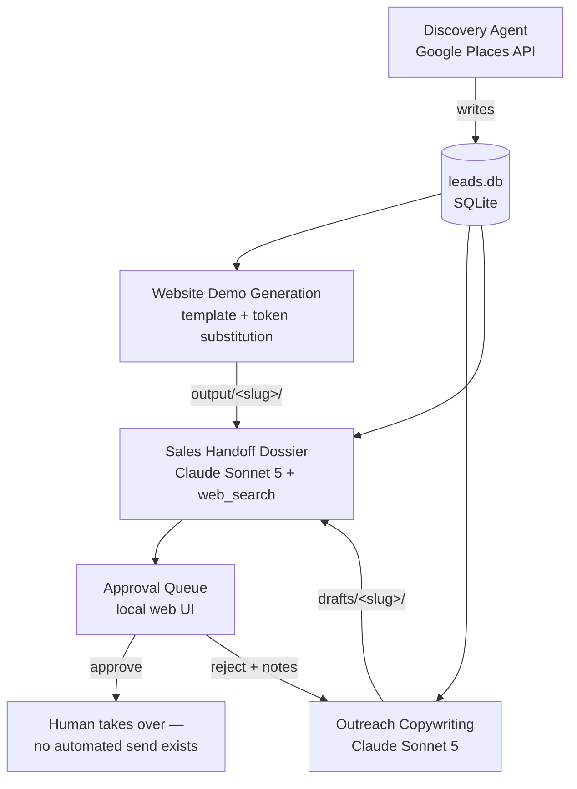
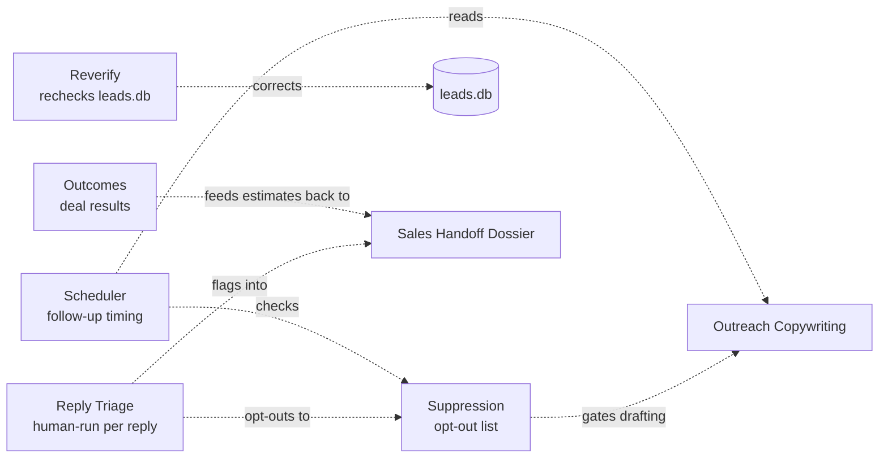

# Tattoo Shop Outreach System — Architecture Blueprint

**Status:** Written after building and testing four working agents against real data, not as an upfront speculative design. Where a number or claim below comes from actual measurement in this project, it's marked as such; where it's a recommendation for scaling beyond what exists today, it's marked as that too.

## 1. What this system does

Finds tattoo shops with no website or an outdated one, builds them a personalized concept site, drafts outreach copy, and prepares a handoff brief for a human salesperson to take over once a lead responds. No message is ever sent automatically — every agent stops at a human-reviewable artifact.

## 2. Overall architecture

Ten independent agents — nine standalone Python scripts plus Approval Queue, a small local web server — each with its own dependencies (`venv`), API key where needed, and README. They communicate through **shared state on disk**, not through direct agent-to-agent calls: one shared SQLite database (`leads.db`) plus each agent's own output folder or database, which other agents read from or correct.

Four agents form the core linear pipeline, gated by a fifth (Approval Queue) before a human takes over:



This is a **linear batch pipeline with human gates**, not a conversational multi-agent system — that shape falls directly out of the task: each stage has a clear input (structured data) and output (structured data + files), stages don't need to negotiate or loop with each other, and a human is supposed to stop the flow before anything goes out. See §11 for why that matters for framework choice.

The other five agents — Suppression, Reply Triage, Scheduler, Reverify, Outcomes — aren't part of this linear flow. None were in the original brief; each was found necessary while building the rest (§19 has the full story on each). They operate on the same shared state independently rather than sitting in the pipeline:



## 3. Agent-by-agent breakdown

| Agent | Does | LLM | Data in | Data out |
|---|---|---|---|---|
| [Discovery](agents/discovery) | Finds shops via Google Places, flags no-website/outdated-website leads | None — pure API + rule-based heuristics | City/state seed list | `leads.db` (`leads`, `search_cells` tables) |
| [Website Demo Generation](agents/website_demo) | Builds a personalized concept site per qualified lead, with on-page SEO (title/meta, OG/Twitter tags, `LocalBusiness` JSON-LD, canonical URL, `sitemap.xml`), hosted live on Cloudflare Pages and noindex by default until a lead responds | None — token templating, no generative text | `leads.db` | `output/<slug>/` (static HTML/CSS/JS), deployed via `deploy.py` |
| [Outreach Copywriting](agents/outreach) | Drafts email, SMS, and 2 follow-ups per lead | Claude Sonnet 5, structured outputs | `leads.db` | `drafts/<slug>/draft.md` + `draft.json` |
| [Sales Handoff Dossier](agents/dossier) | Compiles lead history + research + status + talking points + estimates, citing real website-audit findings (PageSpeed score, missing schema, no phone found, etc.) instead of a generic "outdated" claim when they exist | Claude Sonnet 5 + web_search tool, structured outputs | `leads.db`, demo output, draft output, real funnel data if any exists | `dossiers/<slug>/dossier.md` |
| [Approval Queue](agents/approval_queue) | Local web UI to review/approve/reject drafts before a human takes over sending | None | Draft + dossier files | `approvals.db` |
| [Suppression](agents/suppression) | Opt-out list; Outreach checks before drafting (and before spending the LLM call) | None | Manual opt-out entries | `suppression.db`, independent of `leads.db` |
| [Reply Triage](agents/reply_triage) | Classifies a lead's reply (opt_out/interested/not_interested/question/unclear), auto-suppresses opt-outs, flags the rest into the dossier | Claude Sonnet 5 | A reply a human pastes in after seeing it live | `replies.db`; opt-outs to `suppression.db`; flagged entries into `dossiers/<slug>/dossier.md` |
| [Scheduler](agents/scheduler) | Tracks follow-up timing per lead; stops for any lead that's suppressed or has a logged reply | None | `drafts/<slug>/draft.json`, suppression + reply state | `sends.db` (due/upcoming/mark-sent) |
| [Reverify](agents/reverify) | Re-checks a lead's real-world status against Discovery's own logic; corrects `leads.db` in place and resets stale audit data on a status change | None | `leads.db`, reused Places client + `site_check` heuristic | `leads.db` (corrected in place), `reverify_log.db` |
| [Outcomes](agents/outcomes) | Records final deal results; feeds a funnel back into Dossier's likelihood/budget estimates once real data exists | None | Manual `record` entries | `outcomes.db` |

Notably, several agents use **no LLM at all** — Discovery, Website Demo Generation, Suppression, Scheduler, Reverify, and Outcomes are deterministic API/template/rule-based work. This was a deliberate cost and reliability choice, not an oversight: none of these tasks benefit from generative text, and all are cheaper and more predictable without it.

## 4. Agent communication

There is currently no direct agent-to-agent messaging, no message bus, and no shared in-memory state. Each agent:

1. Reads what it needs from `leads.db` and/or a prior agent's output folder
2. Does its work
3. Writes files, exits

This works because every stage's output is meant to be reviewed before the next stage matters (there's no value in racing Outreach and Dossier generation ahead of a human actually looking at Discovery's results first). What used to require running four scripts by hand in order is now handled by [`run_pipeline.py`](run_pipeline.py) (§6) — still no direct agent-to-agent messaging, just a script that calls each agent's own venv in sequence instead of a human doing it manually.

## 5. Data layer

### SQL database

**Current:** SQLite, one file (`agents/discovery/leads.db`), two tables:

- `leads` — one row per business (identity, NAP, qualification status, website heuristic signals, discovery provenance, raw API response for audit); also carries `audit_status`, `audit_score`, `audit_signals`, `audit_run_at` columns populated by the website-audit step for `qualified_outdated` leads
- `search_cells` — one row per city/state search, tracking pending/done/error for resumability

SQLite was the right choice for the pilot scale (hundreds of leads) — zero setup, single file, no server to run. **Migration trigger:** move to Postgres when either (a) more than one process needs to write concurrently (e.g., a scheduled Discovery run overlapping a human reading the dossier agent's queries), or (b) lead volume grows past what a single file comfortably handles (rough rule of thumb: tens of thousands of rows, well before actual SQLite limits, just for operational sanity — backups, replication, query tooling).

### Vector database

**Not used, and not currently needed.** Every lookup in this system is exact-match (by `place_id`, by qualification status, by slug) — there's no semantic search, no "find leads similar to ones that converted," no large corpus of unstructured text being retrieved by meaning. Introduce one only if a future feature genuinely needs similarity search — e.g., matching new leads against a growing set of past "what worked" outreach examples, or retrieval over a large unstructured research corpus. Don't add one speculatively.

## 6. Workflow orchestration — framework recommendation

The original ask named LangGraph, CrewAI, OpenAI Agents SDK, MCP, Temporal, and n8n as options to evaluate. Given this system's actual shape (linear batch stages, human gates, no agent-to-agent negotiation), here's the honest assessment:

| Framework | Fit for this system | Why |
|---|---|---|
| **LangGraph** | Poor fit | Built for cyclic, conditional multi-agent graphs — agents that loop, revise, or negotiate with each other. Nothing here does that; every stage runs once and stops. Would be the right tool if a future agent needed to iterate with a critic/reviewer agent in a loop. |
| **CrewAI** | Poor fit | Same shape mismatch — role-based multi-agent "crews" collaborating dynamically. This pipeline's agents don't collaborate, they hand off. |
| **OpenAI Agents SDK** | Not applicable | This system is built entirely on Claude/Anthropic; adopting OpenAI's agent framework would mean either mixing model providers for no clear benefit or not actually using the SDK's model-specific features. |
| **MCP (Model Context Protocol)** | **Worth considering later** | Not an orchestrator itself, but a way to expose each agent's capability as a callable tool. If you ever want a single conversational "coordinator" session (in Claude Desktop or elsewhere) that can say "find me leads in Austin" and have it call Discovery, then Demo Gen, then Dossier — MCP is how you'd expose those capabilities as tools rather than separate CLI scripts. |
| **Temporal** | **Best fit for productionizing what exists** | Durable workflow execution designed exactly for "run these steps in order, retry the ones that fail transiently, resume from where it stopped, do it on a schedule." That's precisely this pipeline's shape once it needs to run unattended instead of by hand. |
| **n8n** | Recommended, not what was built | The approval queue (§16) ended up as a small custom stdlib web app instead — the actual scope (list drafts, show one, record a decision) was small enough that standing up a separate platform was more overhead than just building it. Revisit n8n if the approval workflow grows real branching/integration needs beyond that. |

**Recommendation:** don't adopt a multi-agent framework for this pipeline shape — it would add complexity without solving a problem this system has. When ready to move off manual CLI runs, reach for **Temporal** (or a lighter durable-scheduler if Temporal is too much operational overhead — e.g., a cron job plus a simple retry-aware queue) for the orchestration itself, and consider **n8n** specifically for the human-approval surface. Revisit **MCP** if a conversational coordinator interface becomes valuable.

**Interim step, now built:** [`run_pipeline.py`](run_pipeline.py) at the project root runs Website Demo → Outreach by default, with structured logging to `logs/pipeline_<run_id>.log` and a machine-readable `logs/run_<run_id>.json` summary per run (per-stage status, exit code, duration, stdout/stderr tail). Both Discovery (`--run-discovery`) and Dossier (`--run-dossier`) are opt-in, not default — both spend real money, and Dossier specifically was found to be worth generating per-lead on demand rather than batch (§12). It stops the pipeline on the first failing stage by default (`--continue-on-error` to override), and is safe to re-run any time since every downstream stage already skips completed work. This is deliberately *not* Temporal — it's the "cron job plus simple retry-aware queue" tier from the table above, appropriate to current volume. Re-evaluate once runs need to happen unattended or on a schedule rather than triggered by a human.

## 7. Queue system

**Not present today** — each agent processes its lead list sequentially, in-process, one API call at a time. This is fine at pilot scale (tens to low hundreds of leads per run) and was a deliberate simplicity choice.

**Recommendation for scale:** introduce a job queue (e.g., Python `rq` + Redis, or a cloud-native queue like SQS) when either (a) Discovery's search-cell count grows enough that sequential API calls become the bottleneck, or (b) you want multiple agents' work to run concurrently rather than as separate manual invocations. Discovery's `search_cells` table already gives you a natural queue-like unit of work (one row per pending search) — a real queue would consume from that table rather than replace it.

## 8. Error recovery and testing

**What exists today:**

- Discovery: retry with exponential backoff on Places API 429/5xx (`places_client.py`, via the shared `http_retry.py` helper — also used by `psi_client.py`, so both of Discovery's API clients get the same transport-failure and malformed-JSON handling from one implementation, not two that could drift), resumable batch state via `search_cells` (interrupted runs pick up where they left off), graceful degradation on individual website-check failures (marked `needs_review`, doesn't crash the batch)
- Website Demo Generation: idempotent by default (existing demos skipped unless `--force`), so a partial run is safe to just re-run
- Outreach / Dossier: same idempotent-skip pattern

**Gaps, honestly:** no dead-letter handling for permanently-failing leads (they just stay `error` status with no alerting), no cross-agent failure propagation (if Discovery partially fails, downstream agents don't know), no automatic retry orchestration tying the whole pipeline together — a human currently notices failures by reading terminal output.

### Automated testing

**Current:** zero automated tests existed anywhere in this project until they were added for `agents/discovery` and `agents/reverify` — verification before that was entirely manual (`--dry-run` flags, reading real output, spot-checking against real leads). That's not the wrong approach for a solo pilot, but it doesn't scale to safely changing code without re-verifying by hand every time.

- `agents/discovery`: 80 tests — pure-function parsers (on-page SEO/conversion signal extraction, PSI response parsing), `httpx.MockTransport`-based tests for every API client covering success, retry/backoff, transport failure, malformed JSON, and non-retryable status codes, and a schema-migration test verified against a real copy of `leads.db` (not just a synthetic fixture) before being trusted against the actual file.
- `agents/reverify`: 4 tests — the audit-column-reset logic, including the case where `leads.db` hasn't had Discovery's own migration run against it yet.
- `agents/website_demo`: 16 tests (`test_deploy.py`, `test_generate_demo.py`) — the demo-hosting/noindex pure functions: `build_root_robots_txt()`, `find_indexable_html_outside_allowlist()`, `read_indexable_slugs()`, the per-page robots meta tag token, and `write_sitemap()`.
- `agents/outreach`: 8 tests (`test_generate_drafts.py`) — `demo_url_for()` and `demo_status_line()` (the demo-URL pure functions), plus a regression test that the demo status line actually appears in `build_user_prompt()`'s output. Doesn't cover the LLM-calling paths.
- `agents/dossier`: 8 tests (`test_generate_dossier.py`) — same shape as `outreach`: `demo_url_for()`/`demo_status_line()` plus a `build_user_prompt()` regression test. Doesn't cover the LLM-calling/web-search paths.

- `agents/suppression`: 23 tests (`test_db.py`) — phone/email normalization, the add/is_suppressed/list/remove lifecycle, the upsert-on-readd behavior, and the unnormalizable-value edge cases. No LLM involved anywhere in this agent.
- `agents/reply_triage`: 22 tests across `test_db.py` (the replies-log CRUD) and `test_triage_cli.py` (`slugify()`, `lookup_lead()`'s business-name/phone matching, `take_action()`'s per-classification branching including the auto-suppress path, `update_dossier()`'s marker-insert/prepend/missing-file cases). Doesn't cover `classify_reply()` or `main()`, the only parts that call the real Anthropic API.

All using Python's built-in `unittest` — zero new dependency, matching the project's minimal-dependency pattern.

**Not yet covered:** `scheduler`, `outcomes`, and `approval_queue` still rely entirely on the original manual-verification convention. Not because it's wrong, but because it predates the shift to automated tests and hasn't been revisited — worth doing incrementally, the same way `discovery`'s coverage was built up one real bug at a time rather than as an upfront test-everything pass.

## 9. Logging and monitoring

**Current:** individual agents still use `print()` to stdout. `run_pipeline.py` (§6) adds a structured layer on top — timestamped console + file logging per run, plus a JSON summary with per-stage status/duration/output — but that's pipeline-level, not instrumentation inside each agent.

**Production recommendation:** structured logging (Python's `logging` module with a JSON formatter) once anything runs unattended, so failures are queryable rather than lost in a terminal that's already closed. Basic metrics worth tracking once there's real volume: leads discovered per run, qualification rate, per-agent success/failure counts, API spend per run (Places + Anthropic). No monitoring exists today — nothing to lose by adding it later, nothing lost by not having it yet.

## 10. Scalability

Current constraints, all a direct result of the "sequential, one process, run by hand" design:

- Discovery's API calls run one search-cell at a time — concurrency (asyncio or a thread pool with rate limiting) would speed up a full national run considerably
- Outreach and Dossier generation similarly process leads one at a time against the Anthropic API
- SQLite has no real concurrent-writer story — fine while only one agent writes to `leads.db` at a time (true today), a real constraint the moment two processes want to write concurrently

None of this needed fixing to validate the pipeline on a pilot batch, which was the actual goal so far. Fix in this order as volume grows: (1) add concurrency within each agent's API-call loop, (2) move off SQLite once concurrent writers are needed, (3) add the queue/orchestration layer from §6–7 once agents need to run unattended.

## 11. Security

**Current practices** (already in place, not aspirational):

- All API keys in per-agent `.env` files, all `.gitignore`d
- Google API key restricted to exactly the one API it needs (Places API (New)), no broader scope
- No credentials ever handled by Claude directly — every key was typed by the human into `.env` files, never pasted into chat

**Production gaps to close before this handles real volume or real spend:** move secrets to an actual secrets manager rather than local `.env` files once this runs anywhere other than a developer's machine; rotate the Google/Anthropic keys on a schedule; add encryption at rest for `leads.db` once it's not just a local pilot file (lead data is public business info, not sensitive consumer PII, but still worth basic hygiene); apply least-privilege if/when multiple people or services need access.

## 12. Cost optimization

**Measured, not estimated, from this project's actual runs:**

- Google Places API: Pro/Enterprise-tier pricing (the fields this system needs — website, phone — push into the higher tier) around $32–35 per 1,000 calls; a 3-city smoke test produced 180 leads for well under a dollar. A full 25-metro pilot batch is the next real cost checkpoint, not yet run to completion.
- Claude Sonnet 5: intro pricing $2/$10 per million input/output tokens through 2026-08-31 (then $3/$15 standard). Outreach drafts run roughly 1–2K output tokens per lead; Dossier generation costs somewhat more per lead due to the web_search tool's per-search billing on top of tokens (check current pricing before budgeting a large batch — not independently verified against a live run in this session).
- Model choice was itself a cost decision: Sonnet 5 over the default Opus 5 for both Outreach and Dossier, on the judgment that templated marketing copy and lead-research synthesis don't need Opus-tier reasoning. This was a deliberate tradeoff made explicitly, not a default.

**Optimization levers already in use:** Discovery batches by city rather than by individual query; every generation step skips already-done work by default; both LLM agents chose the cheaper capable model rather than the most capable one; Dossier generation (the single most expensive call in the pipeline — tokens plus a `web_search` call per lead) is **opt-in per-lead by default** (`--business "..."`), both directly and in the orchestrator (`--run-dossier` required to include it in a batch run) — generating one for every qualified lead when only a few are ever about to actually be contacted was identified as real, avoidable spend, not a hypothetical one; Dossier's `web_search` tool is capped at `max_uses: 3` so one lead can't quietly trigger an unbounded number of billed searches.

**Tested with a real live comparison (4 calls, one lead, medium vs. high effort) rather than assumed:**

- **Outreach → switched to `effort: "medium"`.** No tools involved, so effort only affects output length/depth: ~20% fewer output tokens (1176 → 944), no quality loss observed in the actual generated copy — still hit every compliance requirement, arguably tighter prose. Clean win, implemented.
- **Dossier → deliberately left at the default (`high`).** The comparison showed `medium` effort made this agent **more expensive**, not less: it triggered *more* `web_search` calls (7 vs. 5) whose accumulated results ballooned input tokens by 54% (26,696 → 40,924), outweighing the output-token savings. Effort doesn't interact simply with tool-calling agents the way it does with plain generation — this is exactly the kind of result that justified testing instead of assuming, and it would have been a real, avoidable cost regression if applied blindly to both agents.

**Investigated and deliberately not adopted:** prompt caching on Outreach's and Dossier's system prompts. Checked the actual token counts first rather than assuming it would help — both prompts (~515 and ~426 tokens) fall under Claude Sonnet 5's 1024-token minimum cacheable prefix, so a `cache_control` marker would silently cache nothing (no error, no benefit, `cache_creation_input_tokens: 0` on every call). Implementing it now would have been dead code; revisit only if these prompts grow substantially.

**Discovery's page depth (`MAX_PAGES = 3`) — checked against real historical data instead of a fresh test, since the data already existed from the real 3-city run:** all three real cities (New York, LA, Chicago) hit Google's own 60-result ceiling every time, meaning all 3 pages were fully used, not wasted overhead. Cutting to 1 page would have discarded roughly two-thirds of available leads in exactly the dense metro markets this pipeline targets — the opposite of the intended savings. Left unchanged. The real, already-exercised cost control for this pipeline is city count (25-metro pilot vs. a national sweep), not page depth per city.

**Not yet explored:** batch API discounts (Anthropic's Batches API runs at 50% cost for non-latency-sensitive work, which describes bulk dossier/draft generation well — worth adopting once volume justifies the added complexity of async batch processing over synchronous calls).

## 13. Legal and ethical considerations

This section reflects real decisions made and reversed during this project, not a hypothetical policy:

- **Google Places API ToS:** no scraping — all data comes through the official API. Photo content specifically is fetched live and never cached, per Google's explicit terms, which is why the color-matching feature currently doesn't store or redistribute lead photos (see known limitation in §14).
- **Website ToS:** the outdated-website heuristic checker respects `robots.txt` before fetching any page.
- **No cloning a real business's design:** early in this project, the demo template defaulted to a real business's actual site (Rooster Ink). This was identified as a real problem — mass-producing lookalikes of a real, unrelated business's design and content for cold outreach — and fixed by moving to an original, generic template with no photography at all, specifically to avoid ever needing someone else's real content again.
- **CAN-SPAM (email):** outreach copy is generated with a non-deceptive subject line requirement, a mandatory physical-address placeholder, and mandatory unsubscribe language — built into the prompt, not bolted on after.
- **TCPA (SMS):** flagged, not solved. Cold SMS to a number scraped from a business listing carries real legal risk — this system drafts an SMS version because it was asked to, but every draft carries an explicit warning that sending it needs actual legal review, not just code review.
- **No fabrication:** every LLM-driven agent is explicitly instructed not to invent facts about a business (staff, reviews, history) and to say "I don't know" / "nothing found" rather than pad output — verified by reading actual output, not just assumed from the prompt.
- **Data handling:** lead data is public business information (name, address, phone, website — all from a public Google listing), which meaningfully lowers privacy risk compared to personal consumer data, but a real production system should still have a retention/deletion policy for leads who request removal.
- **Social media as a photo/color source:** considered and explicitly ruled out. Instagram and Facebook both have stronger anti-scraping terms of service than general web search, and neither offers third-party API access to a business's photos without that business's own permission — which this system doesn't have. A compliant middle ground (reading color values from a lead's *own existing website* CSS, for `qualified_outdated` leads only — not images, not a third-party platform) was proposed as an alternative but left unbuilt at the user's request. Color-matching stays parked entirely pending either that decision or the Places API fix in §16.

## 14. Recommended APIs and LLMs (as actually chosen)

| Component | Choice | Why |
|---|---|---|
| Business discovery | Google Places API (New) | Only ToS-compliant source of structured, verified business data at this scale |
| Copywriting | Claude Sonnet 5 | Cost-appropriate for templated marketing writing; Opus would be overkill |
| Research synthesis | Claude Sonnet 5 + web_search tool | Same reasoning; web_search is Anthropic's server-side, ToS-compliant search, not scraping |
| Website generation | None (template + token substitution) | No generative task exists here — personalization is data substitution, not writing |
| Photo/color data | Google Places Photos API (**currently broken** — see §16) | The only ToS-compliant way to access a business's real photos; general scraping was explicitly ruled out |
| Website audit (`qualified_outdated` leads) | Google PageSpeed Insights v5 / CrUX | Free, quota-limited (not billed) — real Core Web Vitals and performance data, no viable cheaper alternative that isn't scraping |

**Not yet needed:** a dedicated email-sending API (e.g., Postmark, SES), an SMS API (e.g., Twilio) — both are correctly out of scope until the approval/send workflow exists (§16).

## 15. Folder structure (as-built)

```
F:\ClaudeProjects\
├── ARCHITECTURE.md              <- this file
├── SEO_CHECKLIST.md             <- 3-phase SEO checklist (automated demo / client
│                                    onboarding content / manual local authority)
├── run_pipeline.py              <- orchestrator: runs all agents in sequence
├── logs\                        <- per-run logs + JSON summaries from run_pipeline.py
├── agents\
│   ├── discovery\
│   │   ├── discovery_agent.py, places_client.py, site_check.py, db.py, schema.sql, cities_seed.py
│   │   ├── psi_client.py, site_audit.py <- website audit for qualified_outdated leads: PSI performance/CWV + on-page SEO/conversion signals
│   │   ├── leads.db             <- shared SQLite DB, read by every downstream agent
│   │   ├── .env, requirements.txt, README.md
│   ├── website_demo\
│   │   ├── generate_demo.py, photo_palette.py, state_names.py
│   │   ├── template\            <- original, photo-free demo template
│   │   │   ├── index.html, booking.html
│   │   │   ├── artists\index.html      <- truthful placeholder, no fake artists
│   │   │   ├── styles\index.html + 6 style pages  <- fine-line, black-and-grey,
│   │   │   │                             realism, traditional, custom, cover-up
│   │   │   └── css\, js\
│   │   ├── onboarding_templates\    <- Phase 2, NOT copied by generate_demo.py;
│   │   │   ├── artist-page.html         hand-filled per real artist post-signup
│   │   │   └── README.md
│   │   ├── output\<slug>\       <- generated per-lead demo sites
│   │   ├── .env, requirements.txt, README.md
│   ├── outreach\
│   │   ├── generate_drafts.py
│   │   ├── drafts\<slug>\draft.md, draft.json   <- .json is the machine-readable sidecar
│   │   │                                           the scheduler reads follow-up timing from
│   │   ├── .env, requirements.txt, README.md
│   ├── dossier\
│   │   ├── generate_dossier.py
│   │   ├── dossiers\<slug>\dossier.md
│   │   ├── .env, requirements.txt, README.md
│   ├── suppression\
│   │   ├── db.py, schema.sql, suppression_cli.py
│   │   ├── suppression.db       <- independent of leads.db on purpose; opt-outs must
│   │   │                           outlive any lead-data rebuild
│   │   ├── README.md            <- no .env, no requirements.txt: pure stdlib
│   ├── reply_triage\
│   │   ├── triage_cli.py, db.py, schema.sql
│   │   ├── replies.db           <- communication log, independent of leads.db
│   │   ├── .env, requirements.txt, README.md
│   ├── scheduler\
│   │   ├── scheduler_cli.py, db.py, schema.sql
│   │   ├── sends.db             <- what was actually sent, independent of leads.db
│   │   ├── README.md            <- no .env, no requirements.txt: pure stdlib
│   ├── reverify\
│   │   ├── reverify.py, db.py, schema.sql
│   │   ├── reverify_log.db      <- audit trail; this agent DOES update leads.db in
│   │   │                           place (unlike suppression/replies/sends)
│   │   ├── .env, requirements.txt, README.md
│   ├── outcomes\
│   │   ├── outcomes_cli.py, db.py, schema.sql, stats.py
│   │   ├── outcomes.db          <- final deal results, independent of leads.db
│   │   ├── README.md            <- no .env, no requirements.txt: pure stdlib
│   └── approval_queue\
│       ├── server.py, db.py, schema.sql
│       ├── static\index.html, style.css, app.js  <- the actual review-and-approval UI
│       ├── approvals.db         <- decisions, independent of leads.db
│       ├── README.md            <- no .env, no requirements.txt: pure stdlib
└── rooster-ink\                 <- unrelated real business site, moved here to keep it
                                     clearly separate from the outreach tooling
```

Each agent is self-contained (own `venv`, own `.env`, own README) rather than sharing a monorepo-style dependency tree — deliberate, so agents can be developed, tested, and eventually deployed independently.

## 16. MVP vs. production roadmap

### MVP — done today

- All four agents built, tested against real data, verified by reading actual output (not just trusting exit codes)
- Resumable, idempotent, cost-aware Discovery pipeline
- Original, ToS-safe demo template
- Compliance-aware outreach copy generation
- Full sales-handoff dossier with honest, non-fabricated estimates
- Manual CLI-driven, human-reviewed at every stage
- Approval queue — [agents/approval_queue](agents/approval_queue), a real local web UI (Python stdlib `http.server`, bound to `127.0.0.1` only). Pending/Approved/Rejected tabs, full draft detail view, approve/reject with notes, reset-to-pending. Automatically excludes suppressed and already-sent leads. Verified live in a browser against all real leads — approved one, rejected another with a note, confirmed both persisted correctly and reset cleanly.
- Website audit for `qualified_outdated` leads — real PageSpeed Insights/Core Web Vitals data plus on-page SEO and conversion-signal checks (`agents/discovery/psi_client.py`, `agents/discovery/site_audit.py`), zero-LLM, same cost-conscious pattern as the rest of Discovery.
- Demo site hosting — every generated demo is live on Cloudflare Pages (`agents/website_demo/deploy.py`, via the `wrangler` CLI). Every page defaults to **not indexable by search engines** (`<meta name="robots" content="noindex">`, computed per-lead in `page_tokens()`) since these are unsolicited concept mockups sent to businesses that haven't agreed to anything — a lead only becomes indexable once added to `indexable_slugs.txt` after they've actually responded. `deploy.py` also generates a real root-level `robots.txt` from that same file, replacing a pre-existing bug where `robots.txt` was written per-lead inside each `output/<slug>/` folder and silently had no effect (crawlers only read `robots.txt` at a site's actual root). Verified live: a cleared demo serves `index, follow` and appears in `robots.txt`'s `Allow` list, an uncleared demo stays `noindex` and blocked, and flipping one lead doesn't affect any other. See [`agents/website_demo/README.md`](agents/website_demo/README.md#hosting) for the full setup and workflow, and [the design spec](docs/superpowers/specs/2026-08-13-demo-site-hosting-design.md) for the decisions behind it.

### Production roadmap — not yet built

1. **Fix or replace photo/color-matching.** Currently blocked on a Google Cloud account-side gap (Places `photos` field returns empty despite correct requests) — needs investigation in Cloud Console, not more client-side debugging.
2. **Build sending, gated behind approval.** Email via a transactional provider; SMS only after real legal review of the TCPA exposure flagged in §13. This is the highest-stakes remaining piece and should be built last and deliberately.
3. **Move orchestration off manual CLI for good.** `run_pipeline.py` (§6) replaced running four scripts by hand with one command — the remaining step is Temporal (or a lighter scheduler) once runs need to happen unattended or on a schedule rather than triggered by a person.
4. **Add per-agent structured logging and basic monitoring** per §9 — the pipeline-level logging exists now; instrumentation inside each agent (not just print statements) is still open, worth doing once there's unattended volume to watch.
5. **Move secrets to a real secrets manager**, add DB backups, per §11.
6. **Scale Discovery beyond the pilot** with explicit per-run cost budgets, informed by real spend data from the first full 25-metro batch.

## 17. Known bottlenecks and solutions

| Bottleneck | Current impact | Solution |
|---|---|---|
| Sequential API calls in every agent | Slower runs at volume; not yet a real problem at pilot scale | Add concurrency (asyncio/thread pool with rate limiting) |
| SQLite single-writer model | Fine today (one writer at a time); blocks concurrent orchestration | Migrate to Postgres when concurrent writers are actually needed |
| No queue | Every agent run is a manual, blocking CLI invocation | Introduce a job queue once agents need to run unattended (§7) |
| ~~Manual human review via raw markdown files~~ | **Resolved** — [agents/approval_queue](agents/approval_queue) (§16) replaced this with a real queue UI | — |
| Google Places API cost at national scale | A full US sweep is a real, non-trivial cost (~$1,200–1,500 estimated in an earlier session, unverified against a completed full run) | Phased rollout already in place (pilot metros first); add explicit budget caps per run |
| Photo/color-matching feature broken | Currently defaults to template colors for every lead | Needs Google Cloud Console investigation, not more code |

## 18. Future improvements

- Expose agent capabilities via MCP for a conversational coordinator interface, once/if that's genuinely useful over running scripts directly
- Adopt Anthropic's Batch API for Outreach/Dossier generation once volume justifies async processing for the 50% cost discount
- Real photo personalization (colors today; possibly real photos later) once the Places Photos issue is resolved and, separately, once there's a clear legal answer on using a business's own public photos in a pitch built for them
- A feedback loop from actual outreach outcomes (opened, replied, closed) back into the Dossier agent's likelihood-of-closing estimates, which today have no historical data to calibrate against
- Dedupe leads across overlapping city search-radius boundaries beyond exact `place_id` match (documented as a known gap in Discovery's README since day one)
- ~~Feed the website audit's `audit_signals` into Dossier's prompt~~ — **Resolved.** `generate_dossier.py`'s `format_audit_findings()` now turns a `qualified_outdated` lead's stored `audit_status`/`audit_signals` into plain-language findings (PageSpeed score, missing schema, no phone found, etc.) appended to the prompt's `Situation` line, verified against real and synthetic rows built from the actual schema — including the never-audited case (`audit_status` defaults to the string `'not_run'`, not `NULL`, which the check now excludes explicitly rather than falsy-checking).
- Extend automated test coverage (§8) to the agents that still rely entirely on manual verification

## 19. Team roles: status and gaps

The original brief described an "AI team." Here's every role that implies, what's actually built, and — separately — roles that turned out to be necessary while building the rest but weren't named up front.

### Roles named in the original plan

| Role | Status |
|---|---|
| Discovery | **Built.** Finds and qualifies leads. |
| Website Demo Generation | **Built**, with one parked sub-feature (photo/color personalization — §16, §13). |
| Outreach Copywriting | **Built.** Drafts only — no send capability exists. |
| Sales Handoff Dossier ("Human Sales Step") | **Built.** Lead history, research, talking points, budget/likelihood estimates. |
| Review-and-approval step | **Built** — [agents/approval_queue](agents/approval_queue). The brief explicitly required this; a local web UI now provides the queue, approve/reject action, and record of what's been approved, verified live against real leads (§16). |
| Sending | **Not built, deliberately deferred.** No email/SMS integration exists anywhere in the code. |
| System architecture / documentation | **Built** — this document. |

Research was folded into the Dossier agent (via its web_search tool) rather than built as a separate stage — a design choice, not an oversight, since the research need was narrow enough (a few sentences of public context per lead) not to justify its own pipeline stage.

### Roles not originally named, recommended for consideration

Found necessary while building the rest, not because the original brief was incomplete but because building real agents surfaces real operational gaps that are hard to see in advance. In priority order:

1. **Suppression / opt-out list.** **Built** — [agents/suppression](agents/suppression), its own SQLite store independent of `leads.db` (so opt-outs survive lead-data rebuilds), phone-only in practice since Discovery has no email data to suppress against yet. Wired into Outreach Copywriting today (skips drafting, and the API call, for a suppressed lead — verified against a real lead). The integration that actually matters — a hard gate in the eventual Sending agent — still doesn't exist, because sending doesn't exist yet.
2. **Reply/response triage.** **Built** — [agents/reply_triage](agents/reply_triage). No live inbox/SMS integration exists (nothing to monitor yet, since sending doesn't exist), so this is a tool a human runs the moment they personally see a reply: Claude classifies it (opt_out / interested / not_interested / question / unclear), opt-outs are automatically added to the suppression list, and everything else gets written directly into that lead's dossier as a flagged, dated entry. Verified against real leads, including the edge case of a lead with no phone on file. The automatic-detection half of this role — noticing a reply exists in the first place — still requires a live inbox integration that doesn't exist yet.
3. **Follow-up scheduler.** **Built** — [agents/scheduler](agents/scheduler). Required a small upstream change first: Outreach now writes a `draft.json` sidecar alongside `draft.md` so follow-up day-offsets are machine-readable, backfilled for all 10 existing leads. A human records what they actually sent (`mark-sent`); `due`/`upcoming` compute what's next, anchored to the real send date — correctly stopping for any lead that's suppressed or has any logged reply, verified against all four cases (on-time, overdue, suppressed, replied-to) with real leads. Doesn't send anything itself and has no proactive reminder yet — both by design, pending real sending and the orchestration layer respectively.
4. **Lead re-verification.** **Built** — [agents/reverify](agents/reverify). No LLM, reuses Discovery's own Places client and website heuristic directly so there's only one classification implementation in the whole project. Corrects `leads.db` in place when a lead's real-world status has changed, with a 7-day staleness window (configurable) so repeated runs don't re-spend API budget on leads just checked. Verified against the actual failure mode it exists to prevent: deliberately corrupted a real lead's status, confirmed reverify caught and corrected it back to the true state by reading `leads.db` afterward.
5. **SEO.** **Evaluated, deliberately not built as a separate agent.** On-page SEO (title/meta, OG/Twitter tags, `LocalBusiness` JSON-LD, canonical/`robots.txt`/`sitemap.xml` once hosted) was folded into Website Demo Generation instead — it's the same deterministic token-templating work the agent already does, not a distinct pipeline stage. That now includes dedicated `/styles/` pages (fine line, black & grey, realism, traditional, custom, cover-up — six separate crawlable URLs instead of one generic services page) and an `/artists/` page, both with truthful placeholder copy since Discovery has no artist names, specialties, or portfolio data for any lead — fabricating that would violate §13's no-fabrication rule. A parallel `onboarding_templates/` folder (with `Person` schema) exists for hand-filling per real artist once a lead converts and supplies real content — never touched by the automated pipeline. The other half of local SEO — Google Business Profile, reviews, NAP consistency — requires each client's own account credentials and can't be automated without either storing client credentials or requesting OAuth access per future client, both disproportionate to a pilot with zero paying clients so far. Both the content-onboarding and local-authority halves are a manual, phased checklist for the human at handoff: [`SEO_CHECKLIST.md`](SEO_CHECKLIST.md).
6. **Outcome feedback loop.** **Built** — [agents/outcomes](agents/outcomes), with an honest limitation stated up front: zero real outreach has been sent as of this writing, so the statistical value is currently zero by design, not oversight. What exists is real infrastructure — `record`/`report` CLI, a funnel aggregation shared with the Dossier agent, and Dossier now pulls this data into its likelihood/budget reasoning automatically the moment real sends exist, explicitly flagging small samples rather than presenting a fabricated rate. Verified via static checks (confirmed the zero-data case produces no fabricated content, confirmed synthetic non-zero data formats and warns correctly) rather than a live Claude call, per an explicit cost-conscious choice made while building this.

None of these require sending to be live to *design* — #1 and #2 in particular shape the approval/sending system's architecture, so they're worth resolving before, not after, that gets built.
